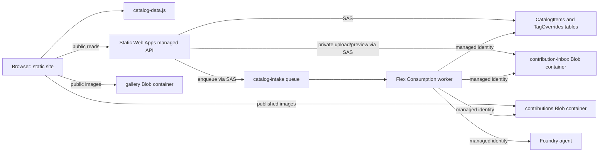
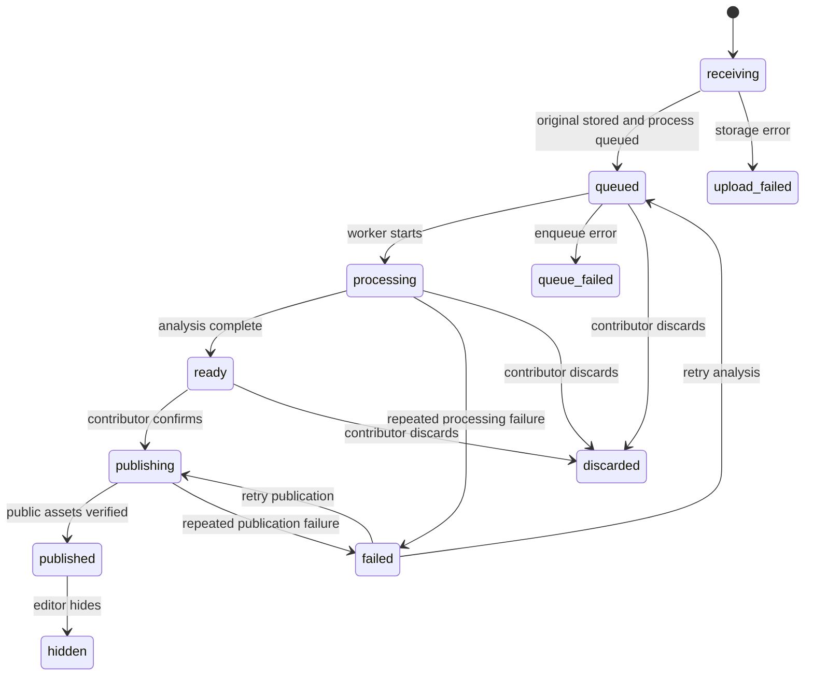

# Architecture

The site combines a shipped static gallery with published community contributions. The browser renders `catalog-data.js` immediately, then fetches published rows from `/api/catalog-items`. `assets-config.js` maps gallery and contribution image paths to public Blob endpoints; thumbnails and display renditions use WebP when supported with JPEG fallback. **Save Image** targets the source image path. A local static preview can render the shipped catalog, but Azure services are required for the API, authentication, and contributions.



## Browse and catalog model

`app.js` merges public community records into its in-memory image list, places newer community items first, and uses the same search and filters for both sources. Search covers filenames, descriptions, tags, product fields, research text, translations, and related metadata. The Photos view pages individual images; the Products view groups identified items by normalized brand, name, and variant (falling back to description). A photo with multiple identified products can appear in multiple groups. Filters apply to the photos within each group; the group detail shows all related photos.

Tag edits are separate from base catalog data. `GET /api/tag-overrides` returns shared overrides from `TagOverrides`; editor writes use `POST /api/tag-overrides/save-many` with entity ETags to detect conflicting updates. The browser caches edits in local storage and can export/import a JSON backup. The `catalog_editor` role is required by Static Web Apps route rules and the write handler. Photo review checks are local browser state only: marking a photo checked changes the local queue/filter but does not alter the catalog record.

## Private contribution to public record

```mermaid
sequenceDiagram
  participant B as Browser
  participant A as Managed API
  participant I as Private inbox
  participant T as CatalogItems table
  participant Q as Queue
  participant W as Worker
  participant F as Foundry agent
  participant P as Public contributions
  B->>B: SHA-256 image ID + random 256-bit draft token
  B->>A: POST /api/intakes (image bytes + token header)
  A->>T: Store token hash and private draft status
  A->>I: Store original bytes
  A->>Q: Enqueue process attempt
  Q->>W: process
  W->>I: Read source
  W->>F: Analyze resized JPEG; identify and research
  W->>I: Write sanitized preview/renditions
  W->>T: Store private result; status ready
  B->>A: Poll status and token-gated preview
  B->>A: POST publish with category, tags, contributor name
  A->>Q: Enqueue publish attempt
  Q->>W: publish
  W->>P: Copy and verify sanitized image/renditions
  W->>T: Mark published; clear token hash
  B->>A: GET /api/catalog-items
```

The API accepts JPEG, PNG, WebP, HEIC, or AVIF bytes up to 24 MiB. The image SHA-256 is a stable draft ID and duplicate detector, **not** proof of ownership. Private status, preview, retry, discard, and publish requests require the random draft token in `x-catalog-draft-token`; only its hash is stored in the table. Current browser code keeps draft IDs and tokens in local storage so a draft can be reopened in the same browser. Someone with access to that browser profile can access the private draft.

The worker re-encodes images with `sharp` before publication, producing a JPEG and thumbnail/display JPEG and WebP renditions. This strips source metadata such as EXIF from the generated images. It sends a separate resized JPEG to the Foundry agent for identification, Japanese text translation, and web research. Agent output is normalized and bounded before it becomes a catalog record. Each process or publish job carries an attempt ID; the worker ignores stale attempts. The poison queue handler marks exhausted attempts as failed so the owner can retry.



The draft remains private through `ready`. Publishing needs a nonblank public contributor name; category and tags can be reviewed before confirmation. The worker verifies SHA-256 metadata and downloaded bytes for all published image renditions before marking the row `published`. Only published rows are returned by the public catalog endpoint. Editors can change contributor attribution or hide a community item. Hiding removes it from public results and queues deletion of its public photo assets.

Private unsubmitted drafts have an expiry set 30 days after intake; a daily timer at 03:15 UTC removes expired private files and rows when it runs successfully. Discard queues private file cleanup, while expiry cleanup covers a missed discard job. Published contributions do not have draft expiry. Queue work is asynchronous, so the UI may show processing or publishing while the worker completes it.

## Trust and operations boundaries

- Anonymous visitors may browse, create private drafts, and publish their own token-bearing drafts. The public upload endpoint has no sign-in or CAPTCHA in this codebase.
- Static Web Apps checks `catalog_editor` for tag writes, hide, and attribution routes. The handlers also validate the editor principal. The editor signs in through `/.auth/login/aad`.
- The managed API uses scoped SAS credentials from app settings for storage and queue calls. The worker uses its managed identity for storage and the Foundry agent.
- Public gallery and contribution image containers serve images; the inbox, queue, and tables remain private. Public research and contributor names are part of published catalog records.
- The worker queue host uses raw JSON messages (`messageEncoding: none`), matching the API's queue producer.

See [Functions reference](functions.md) for endpoint details and [deployment guide](../DEPLOYMENT.md) for Azure configuration and validation.
